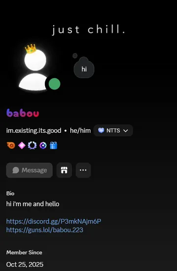
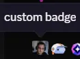
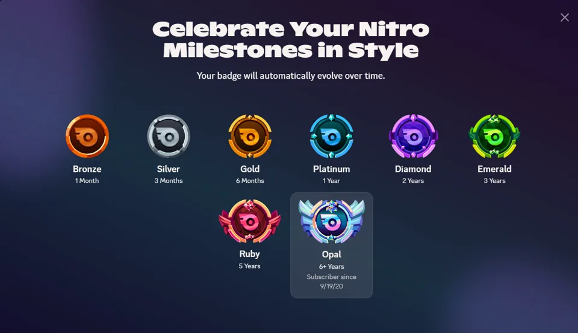
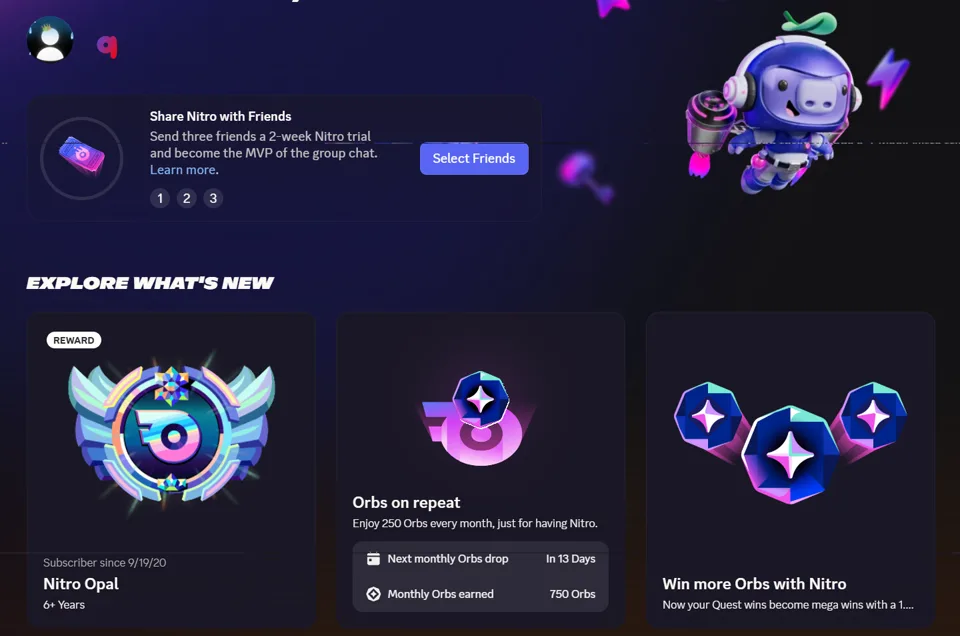
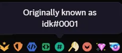
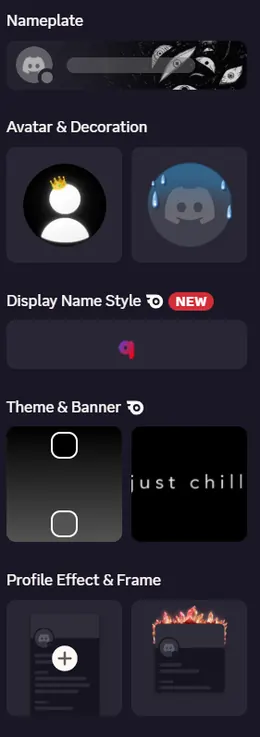
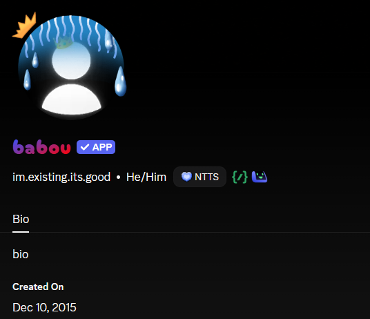
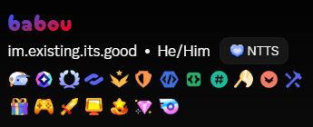

# ProfileSpoofer

  
  
  

> [!WARNING]
> ## 🚧 EARLY DEVELOPMENT / UNSTABLE
> ProfileSpoofer is still under active development.
>
> Bugs, broken Discord patches, visual glitches, crashes, incomplete features and regressions should be expected.
>
> Some bugs may affect multiple parts of the plugin at the same time.
>
> **Do not expect production-level stability yet.**
>
> Discord updates may break features without warning.
>
> I experienced a lot of crashes while debugging this plugin. There may still be plenty of crashes or regressions left, especially after Discord updates.

ProfileSpoofer is a custom Vencord userplugin for locally customizing Discord profile elements.

It locally patches the profile data that compatible Discord client features read — it is not just an image overlay. That is why native UI such as Nitro tenure, profile badges and supported cosmetics can render from the selected local state.

**Unlock All** also unlocks supported cosmetic choices locally in Discord's own picker. It never grants real items, Nitro, badges or permissions, and people without ProfileSpoofer still see the normal account.

> This might be the best profile spoofer for Vencord.

It also includes **ProfileSpoofer Network**, an optional system allowing ProfileSpoofer users to share their customized profiles with other users of the plugin.

Users without ProfileSpoofer continue to see the normal Discord profile.

## Before / After

<table>
  <tr>
    <td align="center"><strong>Before</strong></td>
    <td align="center"><strong>After</strong></td>
  </tr>
  <tr>
    <td></td>
    <td></td>
  </tr>
</table>

## Extra previews

### Custom badge tooltip

### Nitro tenure — local client rendering

ProfileSpoofer does not only place a visual badge over the profile. It locally supplies the Nitro tenure data Discord's own client reads, so the native Nitro screens can render the selected tier, subscriber-since date and badge-evolution flow. Nothing is changed server-side and other Discord users still see the real profile.

<table>
  <tr>
    <td align="center"> <strong>Native milestone picker</strong></td>
    <td align="center"> <strong>Native Nitro Opal card</strong></td>
    <td align="center"> <strong>Badge evolution flow</strong></td>
  </tr>
</table>

### Legacy username tooltip

### Cosmetics panel

### Settings panel

### Bot profile spoofer

Create a local bot-style profile with native **Bot / App** presentation and native application badges, including **Uses Commands** and **Supports AutoMod**. Nothing is created or changed on Discord servers.

  

## Features

- Custom username
- Custom display name
- Custom bio
- Custom pronouns
- Legacy username customization
- Account creation date customization
- Discord-style profile badges
- Gifting Patron badge levels *(Patron, Champion, Luminary, Icon, Hero and Legend)*
- Experimental badge series — Game Variety, Game Time, Streaming and Account Age *(10 levels each)*
- Profile tags *(usage will be improved later)*
- Nitro tenure customization
- Server boost tenure customization
- Avatar decorations
- Profile effects
- Nameplates
- Profile frames
- Custom badges
- Collectibles Unlock All
- ProfileSpoofer Network
- Shared profiles between ProfileSpoofer users
- Debug tools
- Local bot profile spoofer with native bot badges *(Uses Commands and Supports AutoMod)*

## All badges supported by ProfileSpoofer

  

All badges below are rendered locally only. They do not grant real Discord badges or account features.

- **Core:** Discord Staff, Partner, HypeSquad Events, HypeSquad Bravery, Brilliance and Balance, Bug Hunter Level 1 and 2, Early Supporter, Moderator Programs Alumni, Early Verified Bot Developer, Active Developer, Legacy Username, Quest and Orbs.
- **Nitro tenure:** Nitro, Bronze, Silver, Gold, Platinum, Diamond, Emerald, Ruby and Opal.
- **Server Boost tenure:** 1, 2, 3, 6, 9, 12, 15, 18 and 24 months.
- **Gifting Patron:** Patron, Champion, Luminary, Icon, Hero and Legend.
- **Experimental series:** all 10 levels of Game Variety, Game Time, Streaming and Account Age.

## Coming soon

> **Note:** All the coming soon ideas are ideas that will be implemented **before** the phone update.

- Official Discord messages spoofer *(local only)*
- Android mobile port for Revenge (see [mobile/](./mobile/))

## Changelog

### v0.1.7

- Added this changelog.

### v0.1.6

- Finished the local bot profile spoofer.
- Added native **Uses Commands** and **Supports AutoMod** application badges.
- Added the bot profile preview and community voting page.
- Documented the current save-related Discord crash.

### v0.1.5

- Added the local-only Official Discord Messages Spoofer to the roadmap.

### v0.1.4

- Added the supported-badges profile preview.

## Community vote

Think ProfileSpoofer is the best Discord profile spoofer? [Vote on the community page](https://baboub2013-bot.github.io/ProfileSpoofer/) or react directly on the [GitHub poll](https://github.com/baboub2013-bot/ProfileSpoofer/issues/1).

## Current limitations

- Discord updates may break patches without warning.
- Some features are still experimental.
- ProfileSpoofer Network is still under development.
- Custom media handling is still limited.
- Saving your ProfileSpoofer settings may currently crash Discord. This is a known issue and will be fixed later.

## ProfileSpoofer Network

ProfileSpoofer Network allows users to optionally publish supported ProfileSpoofer profile settings.

Other ProfileSpoofer clients can retrieve those settings and render the customized profile locally.

ProfileSpoofer Network does not modify the user's actual Discord profile.

### Privacy

ProfileSpoofer does **not** require your Discord account token, password or cookies.

Network authentication uses Discord OAuth2.

Profile sharing is optional.

Only supported ProfileSpoofer profile fields are published when sharing is enabled.

Custom user-provided media can be disabled by receiving users.

## Installation

> ProfileSpoofer currently targets custom Vencord development builds.

Copy the **contents of** `src/` into:

`Vencord/src/userplugins/ProfileSpoofer`

Then build Vencord normally.

## Project structure

- `src/` — Vencord plugin source
- `assets/readme/` — README previews
- `database/migrations/` — ProfileSpoofer Network database schema

## Network database

ProfileSpoofer Network uses a database for authentication sessions and shared profiles.

The initial database schema is available at:

`database/migrations/0001_init.sql`

This migration is used by the experimental ProfileSpoofer Network backend.

The network backend is still under development and its setup may change between development releases.

## Development status

Current status: **Experimental / Development**

Expect:

- Bugs
- Broken patches after Discord updates
- UI inconsistencies
- Incomplete features
- Regressions
- Features changing between versions
- Occasional Discord client crashes

Bug reports are welcome. **Please include the relevant console logs whenever possible** — they make crashes and broken Discord patches much easier to track down.

## Reporting bugs

When reporting a bug, please include:

- Vencord version
- Discord Stable / PTB / Canary
- ProfileSpoofer version or commit
- What you expected
- What actually happened
- Relevant console logs
- Screenshots if useful

Do not include Discord tokens, cookies, OAuth session tokens or other private credentials.

## Disclaimer

ProfileSpoofer is not affiliated with Discord or Vencord.

ProfileSpoofer only changes the local Discord client experience.

It does not grant real Discord badges, Nitro, collectibles, permissions or other server-side account features.

## License

GPL-3.0-or-later
